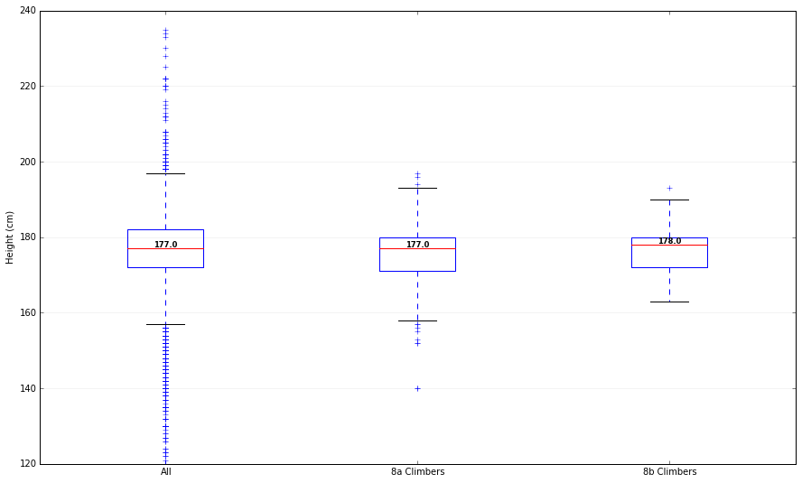
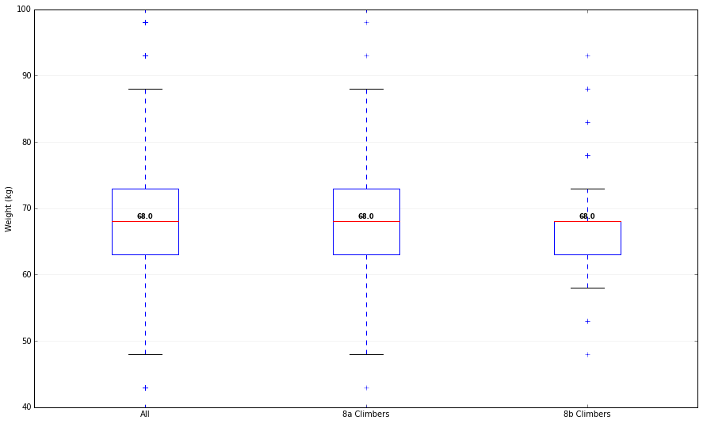
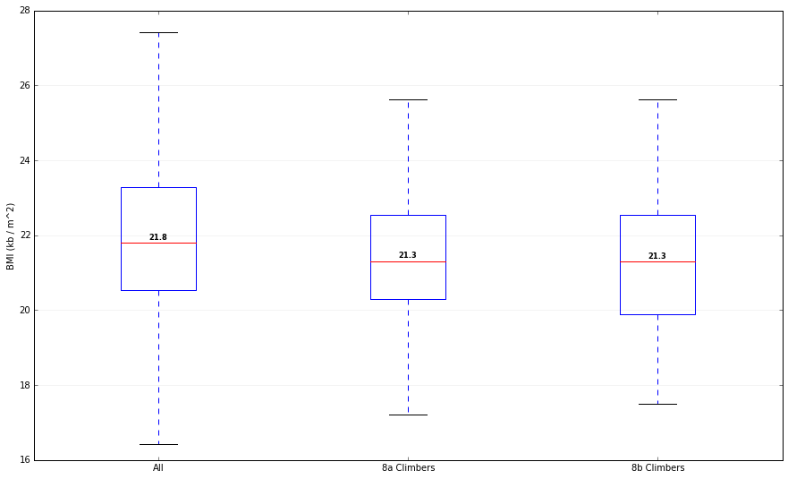

# Introduction

## Quick Aside: The Ethics of Scraping

# Where can I see the data?!?!

I thought you'd never ask! Right now the data is two tables, one for users and one for boulders.
- We're working with **BIG DATA** here, and I needed a petabyte scale data warehouse that was fault tolerant and offered network isolation. You can download a [SQLite](http://sqlite.org/index.html) dump of the data [here](https://github.com/andylamb/8a-data/raw/master/output.sql).
- You can also get CSV files for the [users](https://github.com/andylamb/8a-data/raw/master/users.csv) and [boulders](https://github.com/andylamb/8a-data/raw/master/boulders.csv) tables.

# What Shape are Climbers?

Climbers have long been interested in what sort of body can be dragged up the steepest cliffs and most heinous edges. It's fascinating that body types as different as [Ashima](https://www.instagram.com/ashimashiraishi) (5', ~90lbs) and [Jan Hojer](https://vimeo.com/66473915) (6'2'', ~170lbs) can both excel at the sport. So what does the data on 8a say? Let's dig in!

### Populations
I considered three different populations:
- All the climbers on 8a that listed both height and weight (these fields are optional on the bio). This group had 24979 climbers. Climbers shorter than 120cm (~3'11'') or taller than 245cm (~8') are discarded as measurement errors (i.e. likely trolling in their bios).
- The subset of climbers that had at least 10 ascents 8a or harder. This group had 577 climbers.
- The subset of climbers that had at least 10 ascents 8b or harder. This gropu had 97 climbers.

### Box-and-Whisker Plots
To get a high-level picture of the data, we now turn to our good friend from Intro. Statistics, the box-and-whisker plot. The "box" ranges from the 25th percentile of the data to the 75th, with a line for the median. The "whiskers" show the lowest and highest datums within the interquartile range of the 25th and 75th percentiles, respectively. Check out [this video](https://youtu.be/b2C9I8HuCe4) for a more in-depth explanation.

## Height

**TODO: Figure out how to make the tables more stylish.**

| |All Climbers | 8a Climbers | 8b Climbers|
|---|-------------|-------------|------------|
Median | 177.0 | 177.0 | 178.0 |
25th Percentile | 172.0 | 171.0 | 172.0 |
75th Percentile | 182.0 | 180.0 | 180.0 |

## Weight

| |All Climbers | 8a Climbers | 8b Climbers|
|---|-------------|-------------|------------|
Median | 68.0 | 68.0 | 68.0 |
25th Percentile | 63.0 | 63.0 | 63.0 |
75th Percentile | 73.0 | 73.0 | 68.0 |

## BMI

| |All Climbers | 8a Climbers | 8b Climbers|
|---|-------------|-------------|------------|
Median | 21.80 | 21.30 | 21.30 |
25th Percentile | 20.53 | 20.31 | 19.88 |
75th Percentile | 23.29 | 22.53 | 22.53 |
